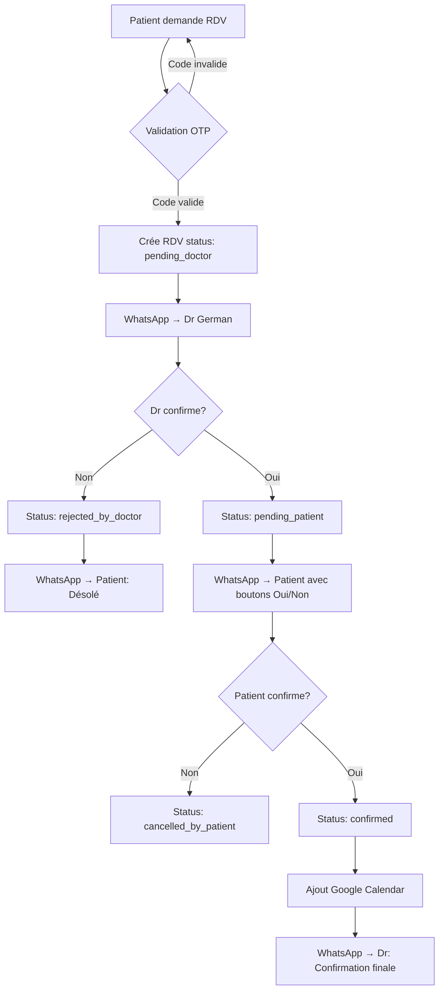

# Système de Confirmation Bidirectionnelle des Rendez-vous

## Vue d'ensemble du flux



## Étape 1: Validation OTP (Prévention des abus)

### Pourquoi OTP?
- **Empêche les fausses réservations**: N'importe qui ne peut plus faire des réservations sans numéro valide
- **Vérification du numéro**: Le patient doit avoir accès au numéro WhatsApp qu'il fournit
- **Protection contre le spam**: Limite les réservations automatisées

### Configuration n8n pour OTP

#### Workflow "Send OTP Code"

1. **Webhook Trigger** - Reçoit la demande de code OTP
   ```json
   {
     "phone": "+96561112299",
     "name": "Ahmed Ali"
   }
   ```

2. **Function Node** - Génère code OTP à 6 chiffres
   ```javascript
   const otp = Math.floor(100000 + Math.random() * 900000);
   const expiresAt = new Date(Date.now() + 5 * 60 * 1000); // 5 minutes
   
   return {
     otp: otp.toString(),
     phone: $json.phone,
     name: $json.name,
     expiresAt: expiresAt.toISOString()
   };
   ```

3. **HTTP Request** - Sauvegarde OTP dans Supabase
   ```
   Method: POST
   URL: https://gpsgswlrgpupmcjrwiec.supabase.co/rest/v1/otp_codes
   Headers:
     apikey: [SUPABASE_ANON_KEY]
     Authorization: Bearer [SUPABASE_SERVICE_ROLE_KEY]
     Content-Type: application/json
   Body:
   {
     "phone": "={{$json.phone}}",
     "code": "={{$json.otp}}",
     "expires_at": "={{$json.expiresAt}}"
   }
   ```

4. **WhatsApp Message** - Envoie le code au patient
   ```
   To: {{$json.phone}}
   Message:
   مرحباً {{$json.name}}!
   
   رمز التحقق الخاص بك هو: *{{$json.otp}}*
   
   الرمز صالح لمدة 5 دقائق فقط.
   
   عيادة الدكتور جيرمان 🦷
   ```

#### Workflow "Verify OTP and Book"

1. **Webhook Trigger** - Reçoit la réservation avec code OTP
   ```json
   {
     "phone": "+96561112299",
     "otp": "123456",
     "name": "Ahmed Ali",
     "email": "ahmed@example.com",
     "service": "Teeth Cleaning",
     "date": "2025-11-25",
     "time": "10:00"
   }
   ```

2. **HTTP Request** - Vérifie le code OTP dans Supabase
   ```
   Method: GET
   URL: https://gpsgswlrgpupmcjrwiec.supabase.co/rest/v1/otp_codes?phone=eq.{{$json.phone}}&code=eq.{{$json.otp}}&expires_at=gt.{{new Date().toISOString()}}
   ```

3. **IF Node** - Vérifie si OTP est valide
   ```
   Condition: {{$json.length}} > 0
   ```

4. **Si OTP valide** → Continue avec création rendez-vous (voir Étape 2)

5. **Si OTP invalide** → Retourne erreur
   ```json
   {
     "error": "Code OTP invalide ou expiré"
   }
   ```

## Étape 2: Confirmation par le Docteur

### Modifications de la base de données

```sql
-- Ajouter nouveaux statuts
ALTER TABLE appointments DROP CONSTRAINT IF EXISTS appointments_status_check;
ALTER TABLE appointments ADD CONSTRAINT appointments_status_check 
CHECK (status IN (
  'pending_doctor',      -- En attente de confirmation du docteur
  'rejected_by_doctor',  -- Refusé par le docteur
  'pending_patient',     -- Confirmé par docteur, en attente patient
  'confirmed',           -- Confirmé par les deux parties
  'cancelled_by_patient', -- Annulé par le patient
  'completed'            -- Rendez-vous terminé
));

-- Modifier le statut par défaut
ALTER TABLE appointments ALTER COLUMN status SET DEFAULT 'pending_doctor';
```

### Workflow n8n "Doctor Confirmation"

1. **Webhook déjà existant** reçoit la réservation (après validation OTP)

2. **HTTP Request** - Crée le rendez-vous avec status `pending_doctor`
   ```
   Method: POST
   URL: https://gpsgswlrgpupmcjrwiec.supabase.co/rest/v1/appointments
   Body: {
     "patient_name": "={{$json.name}}",
     "patient_phone": "={{$json.phone}}",
     "patient_email": "={{$json.email}}",
     "service": "={{$json.service}}",
     "appointment_date": "={{$json.date}}",
     "appointment_time": "={{$json.time}}",
     "status": "pending_doctor",
     "source": "booking_form"
   }
   ```

3. **WhatsApp Message au Docteur** avec boutons interactifs
   ```
   To: +96561112299 (numéro du Dr German)
   
   📋 *طلب موعد جديد*
   
   👤 الاسم: {{$json.name}}
   📞 الهاتف: {{$json.phone}}
   📧 البريد: {{$json.email}}
   🦷 الخدمة: {{$json.service}}
   📅 التاريخ: {{$json.date}}
   🕐 الوقت: {{$json.time}}
   
   هل تؤكد هذا الموعد؟
   
   [رابط: https://your-n8n-url.com/webhook/confirm-doctor?id={{$json.appointment_id}}&action=confirm]
   ✅ نعم، أؤكد
   
   [رابط: https://your-n8n-url.com/webhook/confirm-doctor?id={{$json.appointment_id}}&action=reject]
   ❌ لا، رفض
   ```

### Workflow "Doctor Confirmation Handler"

1. **Webhook Trigger** - Reçoit la réponse du docteur
   ```
   URL: https://your-n8n-url.com/webhook/confirm-doctor
   Params: ?id=UUID&action=confirm ou reject
   ```

2. **IF Node** - Action du docteur?
   ```
   Condition: {{$json.query.action}} === 'confirm'
   ```

3. **Si CONFIRM**:
   - Update status → `pending_patient`
   - Déclenche workflow "Patient Confirmation" (Étape 3)

4. **Si REJECT**:
   - Update status → `rejected_by_doctor`
   - Envoie WhatsApp au patient:
   ```
   نأسف، لا يمكننا تأكيد موعدك في {{date}} الساعة {{time}}.
   
   يرجى الاتصال بنا على +96561112299 لاختيار موعد آخر.
   ```

## Étape 3: Confirmation par le Patient

### Workflow "Patient Confirmation"

1. **Trigger** - Appelé automatiquement après confirmation du docteur

2. **WhatsApp Message au Patient** avec boutons
   ```
   To: {{$json.patient_phone}}
   
   مرحباً {{$json.patient_name}}! 👋
   
   تم تأكيد موعدك من قبل الدكتور جيرمان ✅
   
   📋 تفاصيل الموعد:
   🦷 الخدمة: {{$json.service}}
   📅 التاريخ: {{$json.date}}
   🕐 الوقت: {{$json.time}}
   
   هل تؤكد حضورك؟
   
   [رابط: https://your-n8n-url.com/webhook/confirm-patient?id={{$json.id}}&action=confirm]
   ✅ نعم، سأحضر
   
   [رابط: https://your-n8n-url.com/webhook/confirm-patient?id={{$json.id}}&action=cancel]
   ❌ لا، إلغاء الموعد
   ```

### Workflow "Patient Confirmation Handler"

1. **Webhook Trigger** - Reçoit la réponse du patient
   ```
   URL: https://your-n8n-url.com/webhook/confirm-patient
   Params: ?id=UUID&action=confirm ou cancel
   ```

2. **IF Node** - Action du patient?

3. **Si CONFIRM**:
   - Update status → `confirmed`
   - Ajoute à Google Calendar
   - Envoie notification au docteur:
   ```
   ✅ تأكيد نهائي
   
   المريض {{name}} أكد حضوره:
   📅 {{date}} الساعة {{time}}
   🦷 {{service}}
   ```

4. **Si CANCEL**:
   - Update status → `cancelled_by_patient`
   - Libère le créneau horaire
   - Notification au docteur:
   ```
   ❌ إلغاء موعد
   
   المريض {{name}} ألغى موعده:
   📅 {{date}} الساعة {{time}}
   ```

## Étape 4: Intégration Frontend

### Table OTP codes à créer

```sql
CREATE TABLE public.otp_codes (
  id UUID PRIMARY KEY DEFAULT gen_random_uuid(),
  phone TEXT NOT NULL,
  code TEXT NOT NULL,
  expires_at TIMESTAMP WITH TIME ZONE NOT NULL,
  verified BOOLEAN DEFAULT FALSE,
  created_at TIMESTAMP WITH TIME ZONE DEFAULT NOW()
);

-- Index pour recherche rapide
CREATE INDEX idx_otp_phone_code ON otp_codes(phone, code);

-- RLS: Personne ne peut lire les codes (sécurité)
ALTER TABLE otp_codes ENABLE ROW LEVEL SECURITY;

-- Nettoyage automatique des codes expirés (cron job)
CREATE OR REPLACE FUNCTION cleanup_expired_otps()
RETURNS void AS $$
BEGIN
  DELETE FROM otp_codes WHERE expires_at < NOW();
END;
$$ LANGUAGE plpgsql;
```

### Modifications du composant Booking

1. Ajouter étape OTP avant soumission
2. Envoyer code OTP au numéro du patient
3. Demander au patient d'entrer le code
4. Valider le code avant de créer la réservation

## Coûts estimés

### WhatsApp Cloud API (Gratuit)
- 1000 messages gratuits/mois
- Conversations: ~60 messages par rendez-vous (OTP + confirmations)
- Capacité: ~16 rendez-vous/mois gratuits

### Twilio WhatsApp (Payant)
- $0.005 par message
- ~60 messages × $0.005 = $0.30 par rendez-vous
- Plus fiable pour les boutons interactifs

## Avantages de ce système

✅ **Sécurité maximale**: Validation OTP + double confirmation
✅ **Pas de fausses réservations**: OTP empêche les abus
✅ **Workflow professionnel**: Docteur et patient confirment
✅ **Transparence**: Statuts clairs à chaque étape
✅ **Annulations faciles**: Patient peut annuler via WhatsApp
✅ **Audit trail**: Toutes les actions sont enregistrées

## Prochaines étapes

1. Créer la table `otp_codes` dans Supabase
2. Configurer les 4 workflows n8n:
   - Send OTP Code
   - Verify OTP and Book
   - Doctor Confirmation Handler
   - Patient Confirmation Handler
3. Modifier le composant Booking pour ajouter étape OTP
4. Tester le flux complet avec un vrai numéro

Voulez-vous que je commence par créer la table OTP et modifier le frontend?
