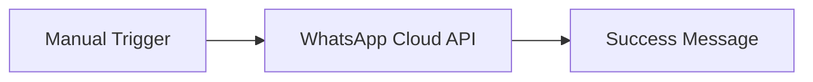
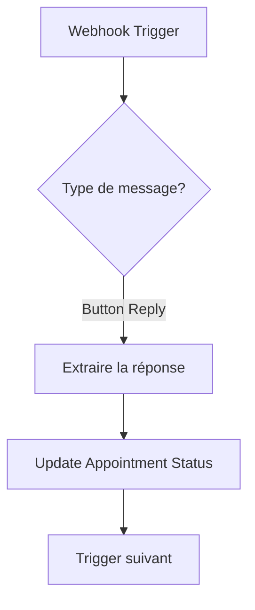

# Configuration WhatsApp avec n8n

## Prérequis absolus

Avant de commencer le système de confirmation bidirectionnelle, vous devez:

✅ **Avoir un compte n8n** (gratuit: 5000 exécutions/mois)
✅ **Configurer WhatsApp Business API** (gratuit: 1000 messages/mois)
✅ **Tester l'envoi de messages** avant tout développement

---

## Option 1: WhatsApp Cloud API (GRATUIT - Recommandé)

### Avantages
- ✅ 1000 messages gratuits/mois
- ✅ API officielle de Meta
- ✅ Pas de carte de crédit nécessaire
- ✅ Support des boutons interactifs

### Inconvénients
- ⚠️ Configuration initiale plus complexe
- ⚠️ Nécessite vérification Meta Business

---

## Étapes de configuration WhatsApp Cloud API

### 1. Créer un compte Meta for Developers

1. Allez sur: https://developers.facebook.com/
2. Cliquez sur "Get Started"
3. Créez un compte ou connectez-vous avec Facebook

### 2. Créer une application Meta

1. Dashboard → "Create App"
2. Type: **Business**
3. Nom: "Dr German Clinic Bot"
4. Business Account: Créer ou sélectionner

### 3. Ajouter le produit WhatsApp

1. Dans votre app → "Add Product"
2. Cherchez "WhatsApp" → Cliquez sur "Set Up"
3. Choisissez votre Meta Business Account

### 4. Obtenir les credentials

1. Dans WhatsApp → Settings → API Setup
2. Notez ces informations CRITIQUES:
   - **Phone Number ID**: `whatsapp:+1234567890` (numéro de test)
   - **WhatsApp Business Account ID**: `123456789012345`
   - **Access Token**: Token temporaire (valable 24h)

### 5. Générer un token permanent

⚠️ **IMPORTANT**: Le token temporaire expire après 24h!

1. Allez sur: https://business.facebook.com/settings/system-users
2. "Add" → Créez un système user: "n8n-bot"
3. Rôle: **Admin**
4. Cliquez sur le user → "Add Assets"
5. Sélectionnez votre App → Full control
6. Cliquez sur "Generate New Token"
7. Permissions à cocher:
   - ✅ `whatsapp_business_messaging`
   - ✅ `whatsapp_business_management`
8. **COPIEZ ET SAUVEGARDEZ CE TOKEN** (vous ne pourrez plus le revoir!)

### 6. Vérifier votre numéro de téléphone professionnel

1. WhatsApp → API Setup → "Add phone number"
2. Entrez le numéro du Dr German: `+96561112299`
3. Vérification par SMS ou appel vocal
4. Entrez le code de vérification

---

## Configuration n8n avec WhatsApp Cloud API

### 1. Créer une nouvelle credential dans n8n

1. Dans n8n: Settings → Credentials
2. "New" → Cherchez "WhatsApp"
3. Type: **WhatsApp Business Cloud API**
4. Remplissez:
   ```
   Access Token: [Votre token permanent]
   Phone Number ID: [Votre Phone Number ID]
   WhatsApp Business Account ID: [Votre WABA ID]
   ```

### 2. Créer un workflow de test



#### Node 1: Manual Trigger
- Juste pour tester manuellement

#### Node 2: WhatsApp Business Cloud API

**Configuration:**
```
Resource: Message
Operation: Send Template

Credential: [Votre credential créée]

From (Phone Number ID): [Votre Phone Number ID]
To: +96561112299 (votre numéro)

Template Name: hello_world
Template Language: en
```

⚠️ **Note**: Meta fournit un template "hello_world" par défaut pour tester

#### Node 3: Réponse de succès
```json
{
  "status": "success",
  "message": "WhatsApp message sent!"
}
```

### 3. Tester l'envoi

1. Cliquez sur "Execute Workflow"
2. Vous devriez recevoir un message WhatsApp sur le +96561112299
3. Le message dira: "Hello World" (template par défaut)

✅ **Si vous recevez le message → Configuration réussie!**
❌ **Si erreur → Vérifiez les credentials**

---

## Option 2: Twilio WhatsApp (PAYANT)

### Avantages
- ✅ Configuration plus simple
- ✅ Support technique excellent
- ✅ Documentation complète
- ✅ Boutons interactifs garantis

### Inconvénients
- 💰 $0.005 par message (~$0.30 par rendez-vous)
- 💳 Carte de crédit nécessaire

### Configuration rapide Twilio

1. **Créer un compte**: https://www.twilio.com/try-twilio
2. **Console** → "Messaging" → "Try it out" → "Send a WhatsApp message"
3. **Notez**:
   - Account SID: `ACxxxxxxxxxxxxxxxxxxxxxxxxxxxxxxxx`
   - Auth Token: `your_auth_token`
   - From: `whatsapp:+14155238886` (Twilio Sandbox)

4. **Configuration n8n**:
   - Credentials → New → HTTP Request
   - Type: Basic Auth
   - Username: [Account SID]
   - Password: [Auth Token]

5. **Node HTTP Request**:
   ```
   Method: POST
   URL: https://api.twilio.com/2010-04-01/Accounts/[SID]/Messages.json
   
   Body (Form Data):
   - From: whatsapp:+14155238886
   - To: whatsapp:+96561112299
   - Body: مرحباً! هذا اختبار من عيادة الدكتور جيرمان 🦷
   ```

---

## Créer des templates de messages personnalisés (Cloud API)

### Pourquoi des templates?

WhatsApp Cloud API **REQUIERT** des templates pré-approuvés pour envoyer des messages proactifs (messages initiés par vous, pas en réponse à un client).

### 1. Créer un template dans Meta Business Manager

1. https://business.facebook.com/wa/manage/message-templates/
2. "Create Template"
3. **Template pour OTP**:

```
Nom: otp_verification_ar
Catégorie: Authentication
Langue: Arabic

Corps du message:
مرحباً {{1}}! 👋

رمز التحقق الخاص بك هو: *{{2}}*

الرمز صالح لمدة 5 دقائق فقط.

عيادة الدكتور جيرمان 🦷
```

4. **Template pour confirmation docteur**:

```
Nom: appointment_pending_doctor_ar
Catégorie: Utility
Langue: Arabic

Corps:
📋 *طلب موعد جديد*

👤 الاسم: {{1}}
📞 الهاتف: {{2}}
🦷 الخدمة: {{3}}
📅 التاريخ: {{4}}
🕐 الوقت: {{5}}

هل تؤكد هذا الموعد؟

Boutons:
- Réponse rapide: نعم، أؤكد
- Réponse rapide: لا، رفض
```

5. **Template pour confirmation patient**:

```
Nom: appointment_confirmation_patient_ar
Catégorie: Utility
Langue: Arabic

Corps:
مرحباً {{1}}! 👋

تم تأكيد موعدك من قبل الدكتور جيرمان ✅

📋 تفاصيل الموعد:
🦷 الخدمة: {{2}}
📅 التاريخ: {{3}}
🕐 الوقت: {{4}}

هل تؤكد حضورك؟

Boutons:
- Réponse rapide: نعم، سأحضر
- Réponse rapide: لا، إلغاء
```

### 2. Attendre l'approbation Meta

- ⏱️ Approbation: 15 minutes à 24 heures
- 📧 Vous recevrez un email de confirmation
- ✅ Status: Visible dans Message Templates

---

## Node n8n pour envoyer un template WhatsApp

### Configuration du node WhatsApp Cloud API avec template

```
Resource: Message
Operation: Send Template

Credential: [Votre credential]

From: [Phone Number ID]
To: {{$json.patient_phone}}

Template Name: otp_verification_ar
Template Language: ar

Components:
- Type: body
  Parameters:
    [
      {
        "type": "text",
        "text": "{{$json.patient_name}}"
      },
      {
        "type": "text", 
        "text": "{{$json.otp_code}}"
      }
    ]
```

---

## Gérer les réponses des boutons WhatsApp

### 1. Configurer un webhook dans n8n

1. Créer un nouveau workflow
2. Ajouter un node "Webhook"
3. Méthode: POST
4. Path: `/webhook/whatsapp-response`
5. Copier l'URL du webhook

### 2. Configurer le webhook dans Meta

1. Meta App Dashboard → WhatsApp → Configuration
2. Webhook → "Configure"
3. Callback URL: `https://your-n8n-url.com/webhook/whatsapp-response`
4. Verify Token: Créez un token secret (ex: `dr_german_2025`)
5. Subscription Fields à cocher:
   - ✅ `messages`
   - ✅ `messaging_postbacks`

### 3. Workflow n8n pour traiter les réponses



#### Node pour extraire la réponse du bouton

```javascript
// Code node dans n8n
const buttonPayload = $json.entry[0].changes[0].value.messages[0].button;

return {
  json: {
    appointment_id: buttonPayload.payload, // ID du rendez-vous
    response: buttonPayload.text, // "نعم، أؤكد" ou "لا، رفض"
    phone: $json.entry[0].changes[0].value.contacts[0].wa_id
  }
};
```

---

## Résumé des coûts

### Configuration GRATUITE (Recommandée)
- 🟢 n8n Cloud: Gratuit (5000 exécutions/mois)
- 🟢 WhatsApp Cloud API: Gratuit (1000 messages/mois)
- 📊 ~60 messages par rendez-vous complet
- 📈 Capacité: ~16 rendez-vous/mois GRATUITS

### Configuration PAYANTE (Si besoin de plus)
- 💰 Twilio: $0.005/message = $0.30/rendez-vous
- 💰 n8n Pro: $20/mois (20k exécutions)
- 📈 Illimité de rendez-vous

---

## Checklist avant de continuer

Avant d'implémenter le système OTP et confirmations:

- [ ] Compte Meta for Developers créé
- [ ] Application Meta créée avec WhatsApp
- [ ] Token permanent généré et sauvegardé
- [ ] Numéro du Dr German vérifié
- [ ] Credential n8n créée et testée
- [ ] Message test reçu avec succès
- [ ] Templates créés et approuvés par Meta
- [ ] Webhook configuré pour recevoir les réponses

---

## Prochaine étape

Une fois que vous avez **testé avec succès l'envoi d'un message WhatsApp** via n8n, nous pourrons:

1. ✅ Créer la table `otp_codes` dans Supabase
2. ✅ Modifier le formulaire de réservation pour ajouter l'étape OTP
3. ✅ Créer les workflows n8n pour le système de confirmation bidirectionnelle

**Voulez-vous que je vous aide avec la configuration Meta/Twilio, ou avez-vous déjà réussi à envoyer un message test?**
